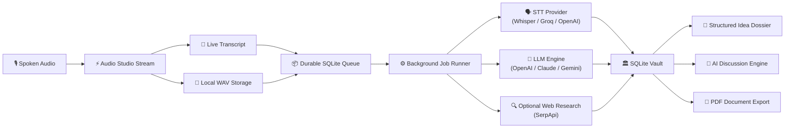

<p align="center">
  
</p>

<h1 align="center">Sotto</h1>

<p align="center">
  <strong>Local-first, voice-first intelligence engine for capturing ideas before they disappear.</strong>
</p>

<p align="center">
  <a href="LICENSE"></a>
  <a href="https://expo.dev"></a>
  <a href="https://reactnative.dev"></a>
  <a href="https://bun.sh"></a>
  <a href="https://sqlite.org"></a>
  <a href="https://github.com/codewithevilxd/sotto"></a>
</p>

---

## 💡 Overview

**Sotto** transforms raw, unfiltered spoken thoughts into **deeply structured, searchable idea intelligence reports** without cognitive friction. 

Traditional note-taking apps force you to categorize, tag, and organize while your mind is still developing an idea. Sotto eliminates that overhead: you open the app, tap record, and speak naturally.

In the background, durable on-device jobs transcribe your voice, research concepts, and synthesize an actionable dossier complete with:
- **Core Gist**: An executive synthesis of what was said.
- **Evidence & Premises**: Foundational claims and supporting points.
- **Risk & Blindspot Check**: Critical scrutiny and hidden failure modes.
- **Next Move**: Concrete, high-leverage immediate action steps.
- **Source Transcript & Audio**: Verbatim original words and optional recorded audio playback.

---

## 🔒 The Local-First Guarantee

Privacy is not a feature in Sotto—it is the foundational architecture:

| Pillar | Architecture Guarantee |
| :--- | :--- |
| **Zero App Backend** | There are no Sotto servers, no telemetry endpoints, and no middleman proxies. |
| **No Account Required** | Open the app and start recording instantly. No login, no signup, no tracking. |
| **Local SQLite Storage** | All records, drafts, discussions, and job pipelines live exclusively in an on-device SQLite database with write-ahead logging (WAL). |
| **Hardware Keystore Security** | Provider API keys are protected using Android `EncryptedSharedPreferences` / `SecureStore`. Keys never leave the device except directly to the provider's HTTPS endpoint. |
| **Bring Your Own Provider (BYOP)** | Connect your own API keys directly to OpenAI, Anthropic, Groq, Cerebras, OpenRouter, Google Gemini, or custom OpenAI-compatible endpoints. |

---

## 🚀 Key Features

### 🎙️ Instant Voice Capture
- **Low-Friction Hero Experience**: The app boots directly into a minimalist recorder.
- **Real-Time Live Transcription**: Watch your thoughts stream as text while you speak.
- **Audio Lifecycle Management**: Pause, resume, discard, or finish with a single tap.
- **Safe State Recovery**: Interrupted recordings are automatically preserved as durable drafts.

### 🏛️ Searchable Idea Vault
- **Instant Search**: Full-text filter across titles, summaries, transcripts, and tags.
- **Category Filtering**: Organize captures by actionable state, status, or date.
- **Bulk Data Operations**: Select, export, or delete multiple ideas with atomic cascading.

### 📊 Sectioned Idea Intelligence Reports
- **Structured Sections**: Read your thoughts broken down into Gist, Evidence, Risks, Next Steps, and Raw Transcript.
- **Auditable Revisions**: Regenerate sections with different prompts or providers while maintaining immutable revision history.
- **Publication-Ready Export**: Generate polished, branded PDF reports directly on-device with `expo-print` and `expo-sharing`.

### 💬 Deep AI Discussion Hub
- **Interactive Idea Interrogation**: Chat directly with your idea to challenge assumptions, explore edge cases, or draft implementation specs.
- **Live Proposal Integration**: When an AI discussion yields a breakthrough, apply the update directly to the Idea Report.
- **Context-Aware Prompt Chips**: Fast shortcuts to "Play devil's advocate", "List competitor risks", or "Draft MVP outline".

### 🌐 Autonomous Web Research (Optional)
- **SerpApi Integration**: Automatically verifies facts, explores industry analogs, and grounds ideas with live web citations.

---

## 🏗️ Architecture & Pipeline



---

## 🧩 Supported AI & Speech Providers

Sotto connects directly from your device to all major frontier and open-weight providers:

| Provider | Speech-to-Text (STT) | Language Model (LLM) | Streaming |
| :--- | :---: | :---: | :---: |
| **OpenAI** | Whisper-1 | GPT-4o, GPT-4o-mini, o1, o3-mini | ✅ |
| **Anthropic** | — | Claude 3.7 Sonnet, Claude 3.5 Haiku | ✅ |
| **Groq** | Whisper Large v3 (Ultra-Fast) | Llama 3.3 70B, DeepSeek R1 Distill | ✅ |
| **Google Gemini** | Gemini Speech | Gemini 2.0 Flash, Gemini 1.5 Pro | ✅ |
| **Cerebras** | — | Llama 3.1 70B / 8B (Extreme Speed) | ✅ |
| **OpenRouter** | OpenRouter Audio | Any Frontier or Open-Source Model | ✅ |
| **Custom Endpoint** | OpenAI-Compatible STT | OpenAI-Compatible Chat Completions | ✅ |

---

## 🛠️ Technology Stack

- **Framework**: [Expo SDK 54](https://expo.dev) + [React Native 0.81.5](https://reactnative.dev)
- **Routing**: [Expo Router v6](https://docs.expo.dev/router/introduction/) (File-based typed routing)
- **Package Manager & Runtime**: [Bun](https://bun.sh)
- **Compiler**: React 19 + React Compiler enabled
- **Local Database**: `expo-sqlite` (SQLite 3 with WAL mode, foreign keys, and subscriber events)
- **Secure Storage**: `expo-secure-store` (Android Hardware Keystore / KeyStore encrypted)
- **Audio Capture**: `@siteed/audio-studio` + `expo-audio`
- **Typography**: `@expo-google-fonts/pacifico` (Signature Brand Header) & `@expo-google-fonts/comic-relief`
- **Iconography**: `phosphor-react-native` (Phosphor Icons)

---

## 💻 Development & Getting Started

### Prerequisites

1. **Bun**: Install [Bun 1.3+](https://bun.sh) (`curl -fsSL https://bun.sh/install | bash` or `powershell -c "irm bun.sh/install.ps1 | iex"`).
2. **Android SDK & Java 21**: Android Studio with SDK Tools, platform-tools (`adb`), and JDK 21 configured.
3. **Android Device or Emulator**: Developer options and USB Debugging enabled.

### Installation

```bash
# Clone the repository
git clone https://github.com/codewithevilxd/sotto.git
cd sotto

# Install dependencies using Bun
bun install
```

### Running Locally

Start the Metro bundler:

```bash
bun run start
```

Run directly on your connected Android device:

```bash
bun run android
```

---

## 🧪 Quality & Validation Suite

Sotto enforces strict automated verification before any build or commit:

```bash
# Typecheck application code (strict TypeScript, zero errors)
bun run typecheck

# Run full Bun unit test suite (38/38 passing)
bun test

# Audit JSDoc headers (@file, @description, @author, @license)
bun run docs:audit

# Run ESLint check
bun run lint

# Check and enforce code formatting (Prettier)
bun run format:check
bun run format

# Test Android Hermes production export
bunx expo export --platform android
```

---

## 📂 Project Structure

```text
sotto/
├── .github/              # CI/CD Workflows (Android APK release and build pipelines)
├── scripts/              # Repository maintenance tooling
│   └── audit-jsdoc.js    # Enforces JSDoc author and license tagging
├── src/
│   ├── app/              # Expo Router filesystem routes
│   │   ├── _layout.tsx   # Root layout with font loading & runtime hydration
│   │   ├── index.tsx     # Hero home screen (Voice recorder & recent captures)
│   │   ├── onboarding.tsx# First-run credential & provider setup
│   │   ├── vault/        # Idea repository and detailed dossier view
│   │   ├── discuss/      # AI interrogation & interactive idea discussion
│   │   └── settings/     # Privacy, providers, web search, and data export
│   ├── assets/           # Brand mascot, application icons, and graphics
│   ├── components/       # Reusable presentational design system components
│   │   ├── home/         # Recorder panel, live captions, and greeting
│   │   ├── vault/        # Idea cards, report sections, audio player
│   │   ├── discuss/      # Chat messages, action chips, update proposals
│   │   └── settings/     # Provider editors, stats charts, configuration
│   ├── constants/        # Design tokens (colors, typography, spacing, radii)
│   └── features/         # Core business logic & platform drivers
│       ├── capture/      # Recording engine, live transcription, state machine
│       ├── discussion/   # LLM chat threads and report amendment logic
│       ├── domain/       # TypeScript contracts, error boundaries, types
│       ├── export/       # PDF generation and JSON archive exports
│       ├── jobs/         # Durable background job scheduler & handlers
│       ├── notifications/# Android notification channels & foreground banners
│       ├── onboarding/   # Setup wizard and credential validation
│       ├── provider/     # STT, LLM, and SerpApi adapter implementations
│       ├── runtime/      # Application bootstrap and database singleton
│       └── storage/      # SQLite schema, repositories, and secure storage
└── tests/                # Automated unit tests for database, providers, and jobs
```

---

## 📦 Releases & Deployment

Automated GitHub Actions workflows build production Android APKs:

1. **Continuous Integration**: Every push to `main` executes `android-build.yml` to ensure compilation and tests pass.
2. **Production Release**: Pushing a version tag triggers `android-release.yml` to compile a signed APK and publish a GitHub Release:

```bash
git tag v1.0.0
git push origin v1.0.0
```

---

## 📜 Developer Conventions

All contributions adhere to strict development guidelines:

- **Package Management**: Exclusively use `bun add` (never `npm`, `yarn`, or `npx`).
- **Icons**: Exclusively use Phosphor Icons (`phosphor-react-native`).
- **Headers**: Every source and test file must have complete JSDoc headers specifying `@author Nishant Gaurav` and `@license MIT`.
- **Formatting**: Prettier-enforced code style without exceptions.

---

## 👤 Author

**Nishant Gaurav**
- **GitHub**: [@codewithevilxd](https://github.com/codewithevilxd)
- **Repository**: [https://github.com/codewithevilxd/sotto](https://github.com/codewithevilxd/sotto)

---

## 📄 License

This project is licensed under the **MIT License** - see the [LICENSE](LICENSE) file for details.
